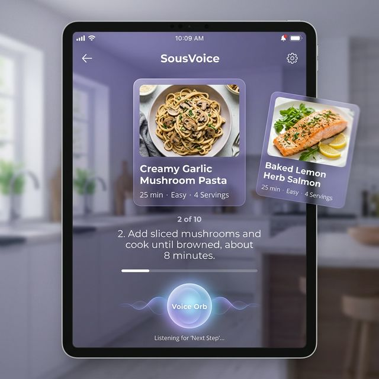

# SousVoice



SousVoice is a voice-assisted recipe app built with React, TypeScript, and Vite. It is designed for hands-free cooking, with step-by-step reading, voice navigation, timers, and accessibility-focused UI states.

## What it does

- Reads recipe steps aloud and automatically continues to the next interaction state.
- Supports voice commands for navigating steps, repeating instructions, starting and stopping timers, and searching recipes.
- Uses a focused cooking mode to reduce visual clutter while a recipe is active.
- Persists accessibility preferences such as text size, voice mode, color mode, and shopping list data.

## Tech Stack

| Area | Stack |
| --- | --- |
| Framework | React 19 + TypeScript |
| Build tool | Vite |
| Styling | Tailwind CSS v4 |
| Animation | Framer Motion |
| State | Zustand |
| Voice / speech | Web Speech API |

## Accessibility

SousVoice is built around common accessibility patterns:

- Clear system status through toasts, focus states, and the voice orb.
- Keyboard support for step navigation and exiting cooking mode.
- Reduced visual complexity in cooking mode.
- Large touch targets for important actions.
- Text scaling and color modes for different vision needs.

## Voice Commands

The app recognizes a small set of cooking-focused commands:

| Command | Action |
| --- | --- |
| `Next`, `Forward`, `Continue` | Move to the next step |
| `Back`, `Previous` | Go to the previous step |
| `Repeat`, `Again`, `Read` | Read the current step again |
| `Go to step 3` | Jump to a specific step |
| `Start timer`, `Set timer`, `Timer` | Start the step timer |
| `Stop timer`, `Pause timer` | Stop the active timer |
| `Search for pasta` | Search the recipe library |
| `Home`, `Show recipes`, `Library` | Leave cooking mode and return to the library |
| `Show list`, `Shopping list`, `Open list` | Open the shopping list |
| `Stop`, `Pause`, `Cancel` | Pause voice recognition |

## Local Development

1. Install dependencies.

   ```bash
   npm install
   ```

2. Start the development server.

   ```bash
   npm run dev
   ```

3. Open the app in your browser.

   ```
   http://localhost:5173
   ```

## Build and Test

- Production build: `npm run build`
- Preview the build locally: `npm run preview`
- Run tests: `npm run test`
- Lint the project: `npm run lint`

## Project Structure

```text
src/
├── components/   UI components such as the recipe card, voice orb, timer, and toast
├── hooks/        Voice controller logic and speech coordination
├── stores/       Global accessibility and cooking state
├── data/         Recipe content
└── test/         Test setup and mocks
```

## Browser Notes

- Voice features depend on the Web Speech API.
- Microphone permission is required for voice input.
- Some browsers support speech recognition more reliably than others.
- If voice input is unavailable, the UI still works with mouse and keyboard.

## HCI Notes

This project explores a few interaction design ideas:

- Progressive disclosure to reduce cognitive load during cooking.
- High-visibility feedback for listening state, timers, and voice actions.
- Error recovery through toasts and manual controls.
- Single-task focus during step-by-step cooking.

